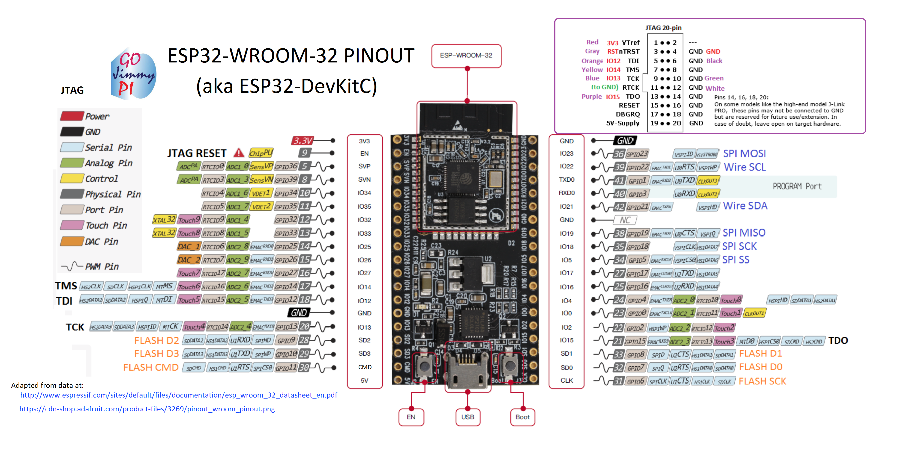

#  SolarEnergyRacers

# Solar Car Control System  

## ESP32 Pinout & Wiring

***Wiring***:

***Wiring***: TODO

## PlatformIO - Command Guide

***Build project***: `platformio run`

***Upload firmware***: `platformio run --target upload`

***Build specific environment***: `platformio run -e esp32dev`

***Upload firmware for the specific environment***: `platformio run -e esp32dev --target upload`

***Monitor device***: `platformio run device monitor`

***Clean build files***: `platformio run --target clean`

## License

This project is published under the GNU General Public License v3.0, see [LICENSE](LICENSE).
