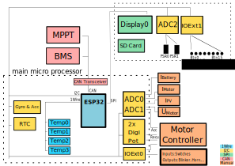

`` SolarEnergyRacers

---

# Solar Car Control System

 

## ESP32 Pinout & Wiring

**_Wiring_**:

## Wiring / Port Usage

| Device:Port         | Functionality          |
| :------------------ | :--------------------- |
| **_ESP32_** | main micro processor   |
| ESP32:22            | I2C:SCL                |
| ESP32:23            | I2C:SDA                |
| ESP32:15            | SERIAL:TX              |
| ESP32:16            | SERIAL:RX              |
| ESP32:18            | SPI:MOSI               |
| ESP32:19            | SPI:MISO               |
| ESP32:5             | SPI:CLK                |
| ESP32:12            | 1Wire                  |
| ESP32:13            | GPIO:LED_BUILTIN       |
| ESP32:33            | GPIO:PCF8574_INTERRUPT |
| ESP32:14            | SPI:CS_SD_CARD         |
| ESP32:32            | SPI:CS_TFT_SCREEN      |
| ESP32:4             | SPI:DC                 |
| ESP32:21            | SPI:RST                |
| ESP32:25 DAC        | CAN:TX                 |
| ESP32:26 DAC        | CAN:RX                 |

| **_ADS1115_** |    Analog to digital converter    |
| :-------------------- | :--------------------------------: |
| ADC0, I2C Addr 0x48   |                                    |
| ADC0:0                | motor controller, speed indication |
| ADC0:1                |    Ibat: battery current sensor    |
| ADC0:2                |     Imot: motor current sensor     |
| ADC0:3                |       Ipv: pv current sensor       |
| ADC1, I2C Addr 0x49   |                                    |
| ADC1:0                |   Ubat: battery voltage (analog)   |
| ADC1:1                |   Umot: motorcontroller voltage   |
| ADC1:2                |                                    |
| ADC1:3                |                                    |
| ADC2, I2C Addr 0x4a   |                                    |
| ADC2:0                | steering wheel acceleration piezo |
| ADC2:1                | steering wheel deceleration piezo |
| ADC2:2                |                                    |
| ADC2:3                |                                    |

| **_MCP23014_** |      Input/Output extender      |
| :--------------------- | :-----------------------------: |
| **IOExt0**       |                                |
| IOExt0:0 in            | switch (status): battery on/off |
| IOExt0:1 in            |   switch (status): PV on/off   |
| IOExt0:2 in            |  switch (status): motor on/off  |
| IOExt0:3               |       ~~mc: eco/power~~       |
| IOExt0:4               |         ~~mc: on/off~~         |
| IOExt0:5 in            |    switch (status): fwd/rwd    |
| IOExt0:6               |         ~~pv: on/off~~         |
| IOExt0:7               |   output: battery fan on/off   |
|                        |                                |
| IOExt1:0               |     output: left indicator     |
| IOExt1:1               |     output: right indicator     |
| IOExt1:2               |          output: horn          |
| IOExt1:3               |       output: head light       |
| IOExt1:4               |          output: light          |
| IOExt1:5               |                                |
| IOExt1:6               |                                |
| IOExt1:7               |                                |
| **IOExt2**       |     steering wheel buttons     |
| IOExt2:0               |     button: left indicator     |
| IOExt2:1               |     button: right indicator     |
| IOExt2:2               |       button: head light       |
| IOExt2:3               |          button: light          |
| IOExt2:4               |          button: horn          |
| IOExt2:5               |          button: next          |
| IOExt2:6               |       button: power/speed       |
| IOExt2:7               |        button: set/reset        |

| **_ILI9341_** |             3.2" 320x240 display             |
| :-------------------- | :------------------------------------------: |
| ILI9341: CS           |         see ESP32:SPI:CS_TFT_SCREEN         |
| ILI9341: MOSI         |              see ESP32:SPI:MOSI              |
| ILI9341: MISO         | see ESP32:SPI:MISO (Pull Down: 10kΏ to GND) |
| ILI9341: CLK          |              see ESP32:SPI:CLK              |
| ILI9341: D/S          |           Pull Down: 10kΏ to GND           |
| ILI9341: SD_CS        |                                              |

| **_DS1803_** |       digital potentiometer       |
| :------------------- | :-------------------------------: |
| SCL:8                |         see ESP32:I2C:SCL         |
| SDA:9                |         see ESP32:I2C:SDA         |
| H0:12                |       VCC at 5V Powersupply       |
| W0:10                |       MC:acceleration input       |
| L0:11                | GND at 5V Powersupply + ESP32:GND |
| H1:1                 |       VCC at 5V Powersupply       |
| W1:3                 |      MC: deceleration input      |
| L1:2                 | GND at 5V Powersupply + ESP32:GND |
| A0:6                 |       GND for address 0x28       |
| A1:5                 |       GND for address 0x28       |
| A0:4                 |       GND for address 0x28       |

| **_DS1307_** | RTC, real time clock |
| :------------------- | :------------------: |
| SCL                  |  see ESP32:I2C:SCL  |
| SDA                  |  see ESP32:I2C:SDA  |

| **_Gyro+Acc_** | gyroscope & accelerator |
| :--------------------- | :---------------------: |
| SCL                    |    see ESP32:I2C:SCL    |
| SDA                    |    see ESP32:I2C:SDA    |

| **_Temp_** | temperature sensor |
| :----------------- | :----------------: |
| Temp0              |  see ESP32:1Wire  |
| Temp1              |  see ESP32:1Wire  |
| Temp2              |  see ESP32:1Wire  |
| Temp3              |  see ESP32:1Wire  |

| **_SD_** |         sd card         |
| :--------------- | :----------------------: |
| CS               | see ESP32:SPI:CS_SD_CARD |
| MOSI             |      see ESP32:MOSI      |
| MISO             |      see ESP32:MISO      |
| CLK              |      see ESP32:CLK      |
| D/S              |        required?        |

| **_Serial_** | serial telemetry communication |
| :------------------- | :----------------------------: |
| RX                   |      see ESP32:SERIAL:RX      |
| TX                   |      see ESP32:SERIAL:TX      |

| **_MPPT_** | maximum power point tracking communication |
| :----------------- | :----------------------------------------: |
| CAN Lo             |              see ESP32:CAN:Lo              |
| CAN Hi             |              see ESP32:CAN:Hi              |

| **_BMS_** | battery management system communication |
| :---------------- | :-------------------------------------: |
| CAN Lo            |            see ESP32:CAN:Lo            |
| CAN Hi            |            see ESP32:CAN:Hi            |

| **_ILI9341_** |             3.2" 320x240 display             |
| :-------------------- | :------------------------------------------: |
| CS                    |         see ESP32:SPI:CS_TFT_SCREEN         |
| MOSI                  |              see ESP32:SPI:MOSI              |
| MISO                  | see ESP32:SPI:MISO (Pull Down: 10kΏ to GND) |
| CLK                   |              see ESP32:SPI:CLK              |
| D/S                   |           Pull Down: 10kΏ to GND           |

| **_DS1803_** |       digital potentiometer       |
| :------------------- | :-------------------------------: |
| SCL:8                |         see ESP32:I2C:SCL         |
| SDA:9                |         see ESP32:I2C:SDA         |
| H0:12                |       VCC at 5V Powersupply       |
| W0:10                |       MC:acceleration input       |
| L0:11                | GND at 5V Powersupply + ESP32:GND |
| H1:1                 |       VCC at 5V Powersupply       |
| W1:3                 |      MC: deceleration input      |
| L1:2                 | GND at 5V Powersupply + ESP32:GND |
| A0:6                 |       GND for address 0x28       |
| A1:5                 |       GND for address 0x28       |
| A0:4                 |       GND for address 0x28       |

|  |  |
| :- | :-: |

| **_Gyro&Acc_** | gyroscope & accelerator |
| :--------------------- | :---------------------: |
| SCL                    |    see ESP32:I2C:SCL    |
| SDA                    |    see ESP32:I2C:SDA    |

| **_Temp_** | temperature sensor |
| :----------------- | :----------------: |
| Temp0              |  see ESP32:1Wire  |
| Temp1              |  see ESP32:1Wire  |
| Temp2              |  see ESP32:1Wire  |
| Temp3              |  see ESP32:1Wire  |

| **_SD_** |         sd card         |
| :--------------- | :----------------------: |
| CS               | see ESP32:SPI:CS_SD_CARD |
| MOSI             |      see ESP32:MOSI      |
| MISO             |      see ESP32:MISO      |
| CLK              |      see ESP32:CLK      |
| D/S              |        required?        |

| **_Serial_** | serial telemetry communication |
| :------------------- | :----------------------------: |
| RX                   |      see ESP32:SERIAL:RX      |
| TX                   |      see ESP32:SERIAL:TX      |

| **_MPPT_** | maximum power point tracking communication |
| :----------------- | :----------------------------------------: |
| CAN Lo             |              see ESP32:CAN:Lo              |
| CAN Hi             |              see ESP32:CAN:Hi              |

| **_BMS_** | battery management system communication |
| :---------------- | :-------------------------------------: |
| CAN Lo            |            see ESP32:CAN:Lo            |
| CAN Hi            |            see ESP32:CAN:Hi            |

### Default Addresses

#### I2C

Scanning I2C addresses:

| Address | Device                         | Location       |
| ------- | ------------------------------ | -------------- |
| 0x00    | ESP32 I2C master               | main noard     |
| 0x19    | 6-axis inertial sensor, gyro   | main board     |
| 0x20    | MCP23014, Extended digital IOs | main board     |
| 0x21    | MCP23014, Extended digital IOs | steering wheel |
| 0x28    | DS1803, digital analog coder   | main board     |
| 0x48    | ADS1115, analog digital coder  | main board     |
| 0x49    | ADS1115, analog digital coder  | main board     |
| 0x4a    | ADS1115, analog digital coder  | steering wheel |
| 0x68    | DS1307, real time clock        | main board     |
| 0x69    | 6-axis inertial sensor, gyro   | main board     |

### Further Documentation and Findings

- [DOCU--ILI934-MCP230176-ESP32-Hazzy](docs/DOCU--ILI934-MCP23017-ESP32-Hazzy.md)
- Docu [MCP23017](docs/MCP23017.md)

## PlatformIO - Command Guide

**_Build project_**: `platformio run`

**_Upload firmware_**: `platformio run --target upload`

**_Build specific environment_**: `platformio run -e esp32dev`

**_Upload firmware for the specific environment_**: `platformio run -e esp32dev --target upload`

**_Monitor device_**: `platformio run device monitor`

**_Clean build files_**: `platformio run --target clean`

## License

This project is published under the [GNU General Public License v3.0](LICENSE).
