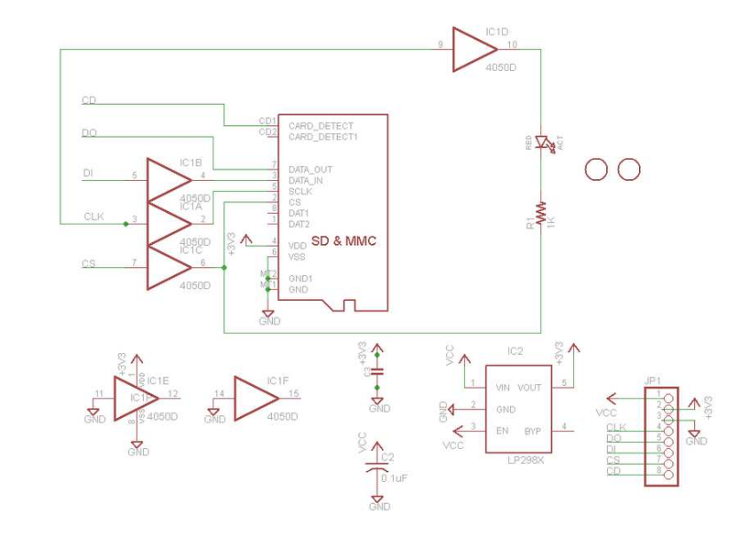
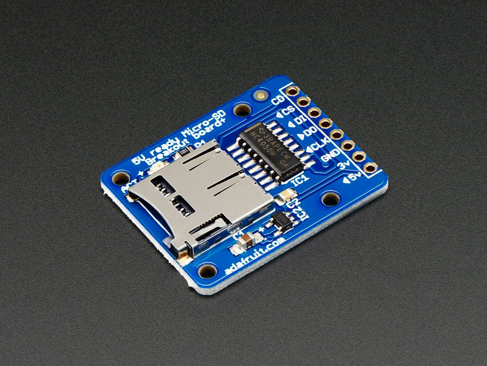
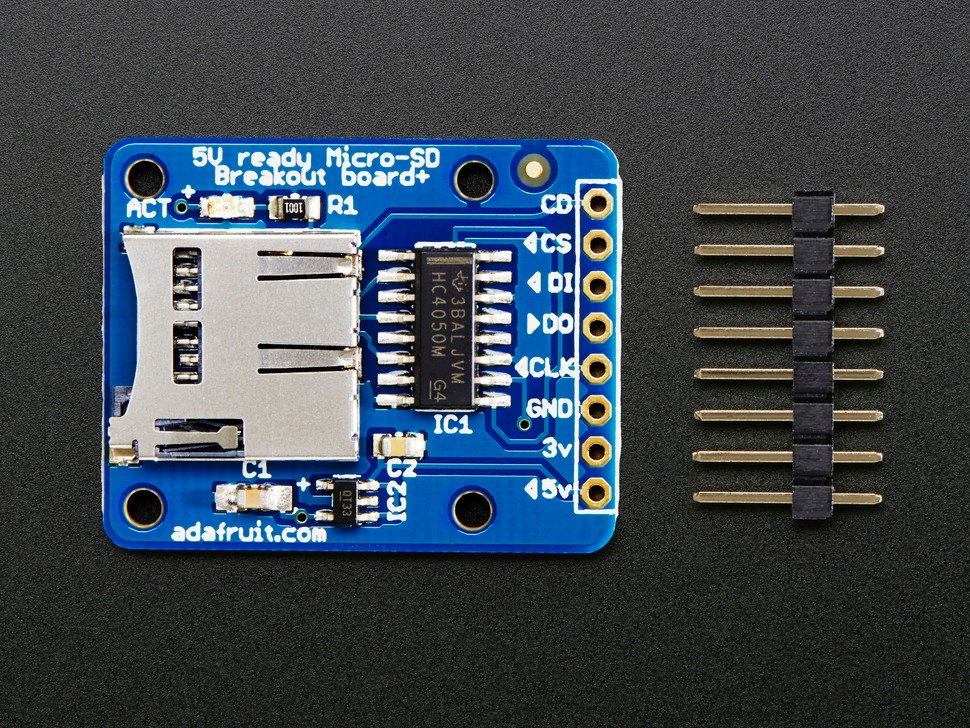

# MicroSD card breakout board+

[Technical Details (Adafruit)](https://www.adafruit.com/product/254#technical-details)

## Description 

Not just a simple breakout board, this microSD adapter goes the extra mile - designed for ease of use.

- Onboard 5v->3v regulator provides 150mA for power-hungry cards
- 3v level shifting means you can use this with ease on either 3v or 5v systems
- Uses a proper level shifting chip, not resistors: less problems, and faster read/write access
- Use 3 or 4 digital pins to read and write 2Gb+ of storage!
- Activity LED lights up when the SD card is being read or written
- Four #2 mounting holes
- Push-push socket with card slightly over the edge of the PCB so its easy to insert and remove
- Comes with 0.1" header (unattached) so you can get it on a breadboard or use wires - your choice
- Tested and assembled here at the Adafruit factory
- Works great with Arduino, with tons of example code and wiring diagrams

To use with an Arduino, connect **GND** to ground, **5V** to 5V, **CLK** to pin 13, **DO** to pin 12, **DI** to pin 11, and **CS** to pin 10. Then you can use the Arduino IDE's SD library which supports FAT and FAT32 SD cards. For details on getting started, check out **[our detailed tutorial, it discusses microSD cards, wiring and how to use this breakout board with an Arduino or CircuitPython](http://learn.adafruit.com/adafruit-micro-sd-breakout-board-card-tutorial)**

## Technical Details 

[Datasheet, EagleCAD, and fritzing available in the product tutorial](https://learn.adafruit.com/adafruit-micro-sd-breakout-board-card-tutorial/download)

Dimensions (without 0.1" header):

- Length: 31.85mm/1.25in
- Width: 25.4mm/1.00in
- Height: 3.75mm/0.15in
- Weight: 3.43g/0.12oz
