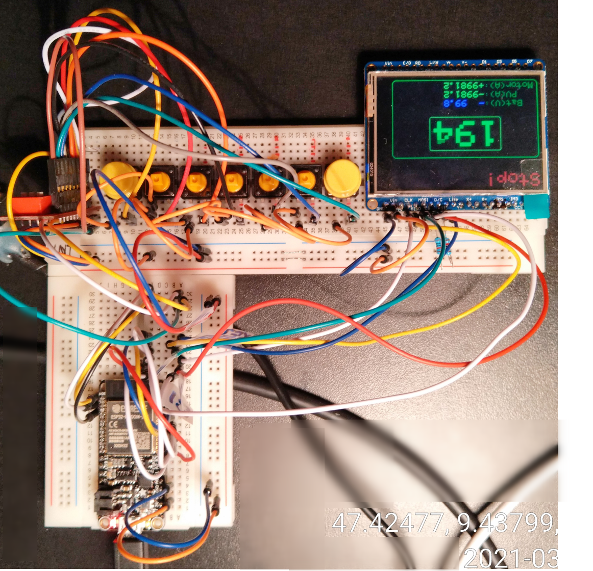

# DOCU ILI9341 + PCF8574 + ESP32-Hazzy

## ILI9341 + PCF8574 +

Leistungsaufnahme Experimentalaufbau mit 

Display ILI9341 (320x240 pixel) mit IO Extender PCF8574 (8 bit) (7 Taster und 1 LED)

| Spannung [V] | Strom [mA] | Leistung [mW] |
| ------------ | ---------- | ------------- |
| 3.0          | 17         | 51            |
| 3.3          | 25         | 82.5          |
| 3.8          | 50         | 190           |
| 4.0          | 60         | 240           |
| 5            | 85         | 425           |

10 Kabel vom Miroprocessor zum Display/Buttons/Regler