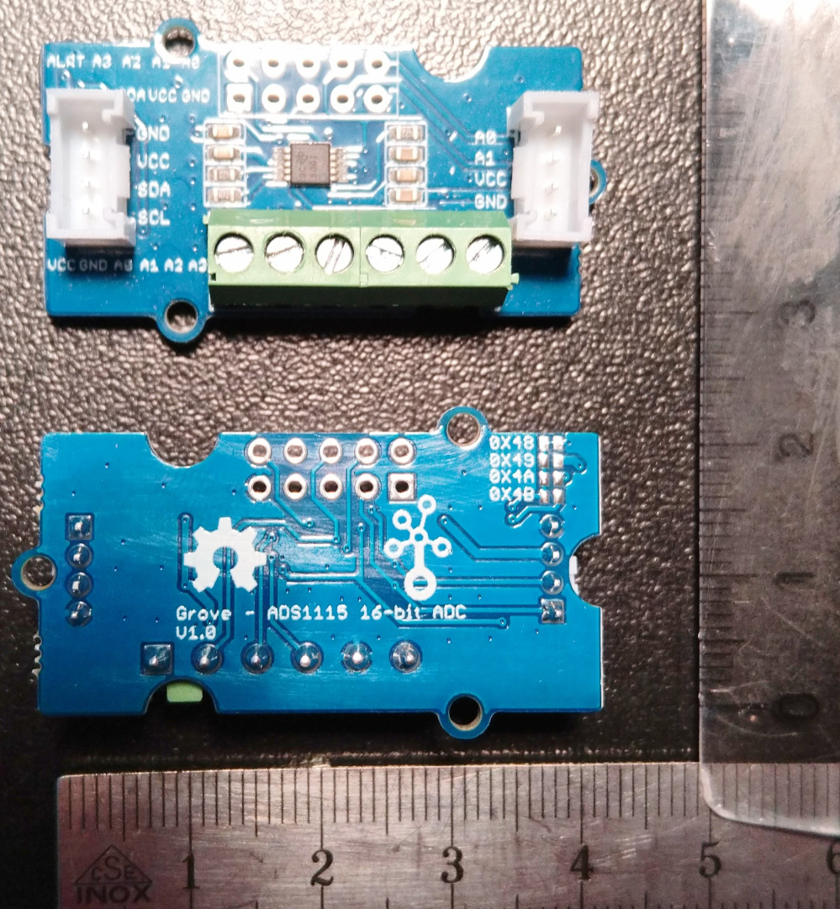

# ADS1115: 4 Channel Analog-Digital-Converter

- [Buy: e.g. distrrelec](https://www.distrelec.ch/en/ads1115-channel-16-bit-analogue-to-digital-converter-with-programmable-amplifier-gain-seeed-studio-109020041/p/30180590?q=Grove+ADS1115&pos=1&origPos=1&origPageSize=50&track=true)
- [Tutorial ###TODO]()

## Pinout and Usage

Board size: 42x24, height with jumpers and plugs : 14

Usage in steering wheel:

- 2 analog in from green screw clamp (pin assignment left from screw clamp: VCC | GND | A0 | A1)
- GND, VCC from green screw clamp
- VCC, GND, SDA, SCL from plug

Usage in car hull:

- ###TODO

## Diagram

## Hints and Discussion

- [ ] May be we can desolder the screw clamp and the plugs and use smaller plugs or soldered wires
