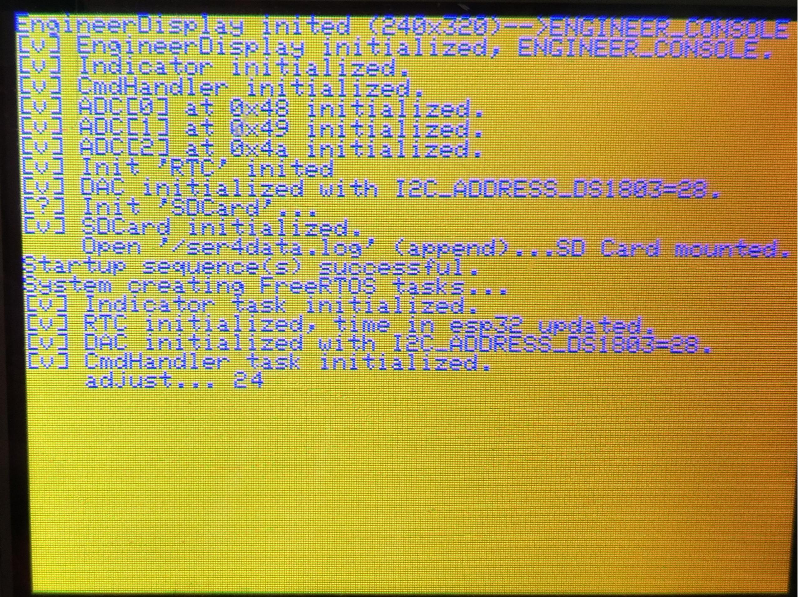
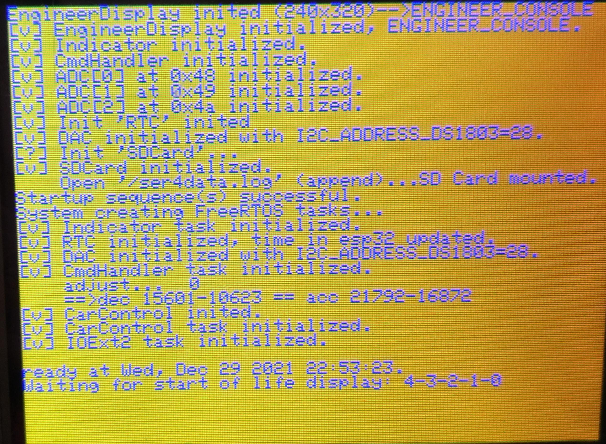

# Checklist for SER-4 Electronik

## Hardware

### Main Board

### Switch Board

### Display Board

### BMC

### MPPTs

### Battery

### Back Camera

## Software

### Boot Screen

Boot screen waiting for `paddle adjust`

Boot screen waiting for visual check (about 5s), then starts driver display

### Engineering Screen

- [ ] Switch on from driver display with driver display button

Simulate by switching on switch board:

- [ ] MC on/off
- [ ] Bat on/off
- [ ] PV on/off

Simulate by turning potis on test console:

- [ ] BMS  I (*I_MC Voltage*) ???
- [ ] BMS U (*I_BAT Voltage*) ???
- [ ] U-min
- [ ] U-avg
- [ ] U-max
- [ ] T-1
- [ ] T-2
- [ ] T-3
- [ ] T-4

Simulate with CAN-Bus test program:

- [ ] MPPT-1
- [ ] MPPT-2
- [ ] MPPT-3
- [ ] Battery Msg

### Driver Screen

- [ ] Switch on from engineering display with driver display button
- [ ] 

Simulate by switching on switch board:

- [ ] MC on/off
- [ ] Bat on/off
- [ ] PV on/off
- [ ] Speed

### SD Card

- [ ] Check mount - write log - unmount cycle
- [ ] Check file and folder print

| Command (case sensitive) | Function                                   |
| ------------------------ | ------------------------------------------ |
| M                        | mount cd card                              |
| P                        | print files and folders to console         |
| C                        | write csv data row into `/ser4data.csv`  |
| J                        | write json data set into `/ser4data.csv` |
| U                        | unmount sd card                            |

- [ ] Life sign blinking red: no logging after Unmount or without inserted card
- [ ] Life sign blinking green: logging active and writing to sd card

## Integration

### Indicators

- **Left**

  - [ ] left screen
  - [ ] left output *O_ind.Left*

  - Delay from button press to switch: ____ ms
- **Right**

  - [ ] right screen
  - [ ] right output *O_ind.Right*

  - Delay from button press to switch: ____ ms
- **Hazard Flash**

  - [ ] right+left screen
  - [ ] right output *O_ind.Right* + left output *O_ind.Left*

  - Delay from button press to switch: ____ ms

### Acceleration / Recuperation

- [ ] Adjust paddles by screen on boot screen
- [ ] Acceleration display value `+ 0`
- [ ] (Re-)Start adjust paddles by screen button P3
- [ ] Timer runs on Driver Info Line
- [ ] Set tension left (press fully and release)
- [ ] Set tension right (press fully and release)

- Press acceleration and deceleration paddles simultaneously
  - [ ] give negative value in display
  - [ ] give >0 to 5V on *O_Decel*
- [ ] Adjusted paddles min/max values are shown in driver display
- [ ] Acceleration display value `+ 0`

- Press recuperation paddle

  - [ ] Negative screen values shown continuously vrom 0 to 99
  - [ ] *O_Decel* extends from 0 to 5 V
  - [ ] Press Break pedal
    - [ ] give -88 in display
    - [ ] give 5V on *O_Decel*
    - [ ] break light on

- Press acceleration paddle

  - [ ] Positive screen values shown continuously from 0 to 99
  - [ ] *O_Accel* extends from 0 to 5 V
  - Press Break pedal while acceleration paddle is pressed
    - [ ] give -88 in display
    - [ ] give 5V on *O_Decel*
    - [ ] break light on

- Set constant SPEED mode
  - [ ] dynamically give 1/- value in Accel display
  - [ ] dynamically give 0-5V on *O_Decel*
  - [ ] dynamically give 0-5V on *O_Accel*
