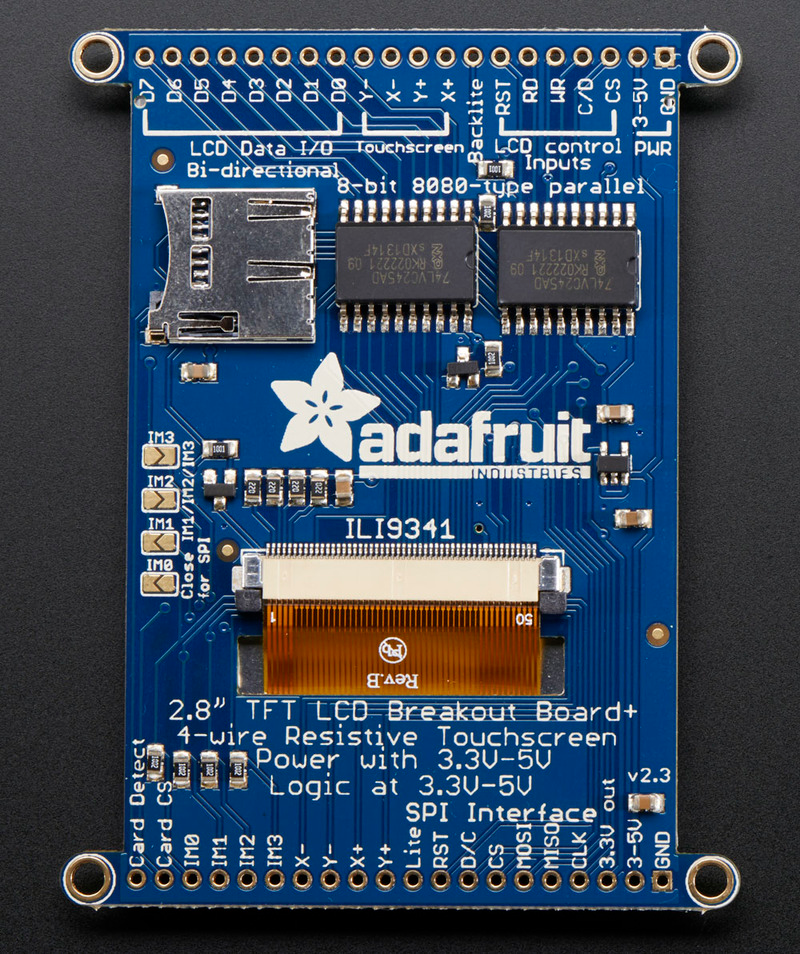
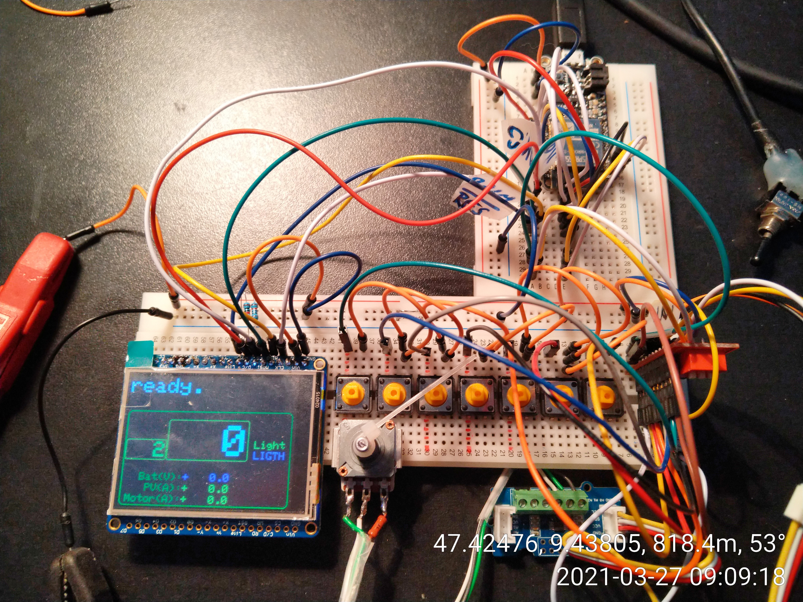
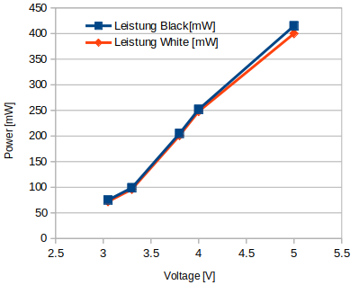

# Steering Wheel

ILI9341 + PCF8574  + ADS1x15 controlled with ESP32-Hazzy

## Product Links

### MicroProcessor

- [Adafruit: HUZZAH32 – ESP32 Feather Board](https://www.adafruit.com/product/3405)
- [Adafruit-ESP32-HUZZAH-Breakout (PCB)](https://github.com/adafruit/Adafruit-ESP32-HUZZAH-Breakout-PCB)

### Display 3.2" 320x240 ILI9341

- [Adafruit: 2.8" TFT LCD with Touchscreen Breakout Board w/MicroSD Socket - ILI9341](https://www.adafruit.com/product/1770)
- [Adafruit: 2.8"/3.2" TFT LCD (PCB)](https://learn.adafruit.com/adafruit-2-8-and-3-2-color-tft-touchscreen-breakout-v2/downloads)
- [Adafruit_ILI9341 (C++ Library)](https://github.com/adafruit/Adafruit_ILI9341)

All logic pins, both 8-bit and SPI sides, are 3-5V logic level  compatible, the 74LVX245 chips on the back perform fast level shifting  so you can use either kind of logic levels. If there's data output, the  levels are at at 3.3V.

#### SPI Mode Jumpers

Display SPI mode: connect **IM1**, **IM2** and **IM3** pins to 3.3V. Do not solder closed **IM0**!

> If you really don't want to solder them, you can also wire the breakout pins to the **3vo** pin, just make sure you don't tie them to 5V by accident! For that reason, we suggest going with the solder-jumper route.
>
> [Adafruit](https://learn.adafruit.com/adafruit-2-8-and-3-2-color-tft-touchscreen-breakout-v2/pinouts)

#### Wiring

Wiring up the display in SPI mode is much easier than  8-bit mode since there's way fewer wires. Start by connecting the power  pins

- **3-5V Vin** connects to the Arduino **5V** pin
- **GND** connects to Arduino ground
- **CLK** connects to SPI clock.
- **MISO** connects to SPI MISO.
- **MOSI** connects to SPI MOSI.
- **CS** connects to our SPI Chip Select pin.
- **D/C** connects to our SPI data/command select pin.

No need to connect the **RST**.

### IO Extender PCF8574

- [8-bit 2.5- to 5.5-V I2C/SMBus I/O expander with interrupt](https://www.ti.com/product/PCF8574)

### AD Wandler ADS1115

- [16-bit, 860-SPS, 4-channel, delta-sigma ADC with PGA, oscillator, VREF, comparator and I2C](https://www.ti.com/product/ADS1115)

## ILI9341 + PCF8574 + ADS1115

10 Kabel vom Miroprocessor zum Display/Buttons/ReglerLeistungsaufnahme Experimentalaufbau mit

- Display ILI9341 (320x240 pixel)
- IO Extender PCF8574 (8 bit) (7 Taster und 1 LED)
- Analog-Digital-Wandler (12bit) und Potentiometer

## U-I-Diagramm bei Spannungsänderung

| Spannung [V] | Strom [mA] | Leistung [mW] |
| - | - | - |
| 3.0 | 20 | 60 |
| 3.3 | 32 | 106 |
| 3.8 | 59 | 224 |
| 4.0 | 73 | 292 |
| 5.0 | 85 | 425 |

## U-I-Diagramm bei Displayänderung

Es wurde bei Vollbild Black und Vollbild White gemessen:

| Spannung [V] | Strom Black  [mA] | Strom White  [mA] | Leistung Black[mW] | Leistung White  [mW] |
| :-: | :-: | :-: | :-: | :-: |
| 3.05 | 25 | 24 | 75 | 72 |
| 3.3 | 30 | 29 | 99 | 96 |
| 3.8 | 54 | 53 | 205 | 201 |
| 4.0 | 63 | 62 | 252 | 248 |
| 5.0 | 83 | 80 | 415 | 400 |

