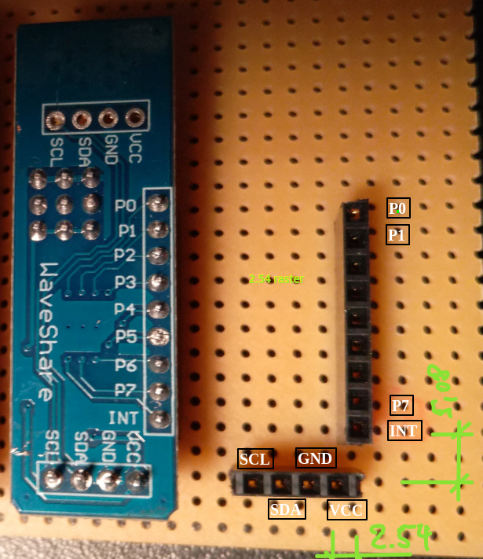

# PCF8574: 8 bit IO Extender with Interrupt

- [Buy: e.g. amazon](https://www.amazon.de/-/en/Mountaineer-PCF8574-IO-Expansion-Expander-Development/dp/B06W564ZSD/ref=sr_1_4?dchild=1&keywords=PCF8574-Modul&qid=1622910129&sr=8-4)
- [Tutorial](https://www.instructables.com/PCF8574-GPIO-Extender-With-Arduino-and-NodeMCU/)

## Pinout and Usage

Board size: 49x16, height with jumpers and pins : 11

Usage in steering wheel:

- 8 bits and interrupt from yellow pins (alls PCF8574 can use the same interrupt wire)
- VCC, GND, SDA, SCL from plug (chainable)

Usage in car hull:

- ###TODO

## Daisy-Chain

## Diagram

- Push buttons for steering wheel
- GND, VCC, I2C (SDA,SCL), Interrupt

### Board Assembly

