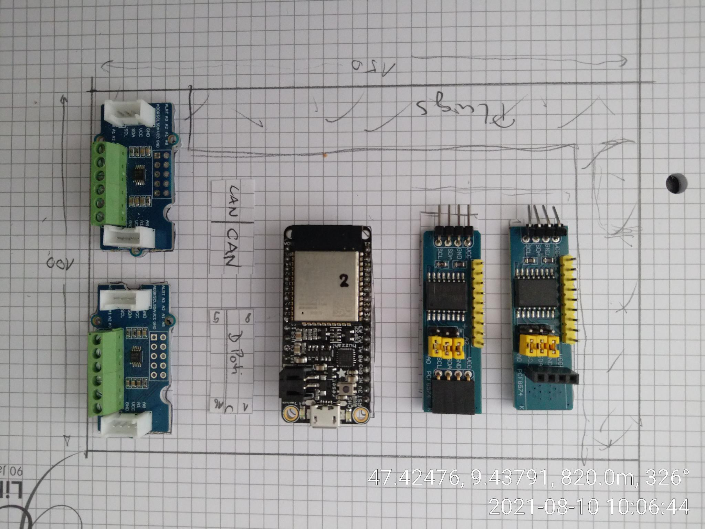

# ELT-Schema and Board Design

## Mainboard

### Layout Idee
 - Platine 150x100

 

To change connectors:

- PCF8574 boards 
  - remove all plugs
  - reassembly 9 pin plug (8 IOs and Interrupt) and 4 pin I2C pin (I2C) on backside
  - drill mounting hole
- ADS1115 grove boards
  - remove all plugs and connectors
  - reassembly 4 pins (analog in) and 4 pins (I2C) on backside

## Steeringwheel Board

