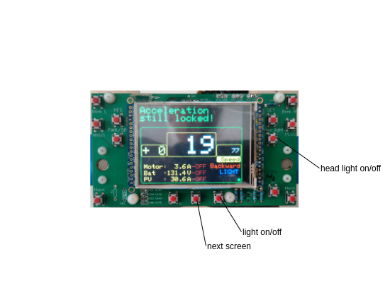

# SER4 Drivers Manual

## Preparation

## Control Elements

### Mainboard

(nothing to do by the driver)

### Emergency Controls

TODO: DESCRIBE IT!

### Switch Board

| Switch Name | Function (what is switched)        | Driver Screen | Engineer Screen |
| ------------- | ------------------------------------ | --------------- | ----------------- |
| 12V on/off  | Main switch for controller.        | no            | no              |
| MC on/off   | Montor controller                  | yes           | yes             |
| Batt on/off | Battery                            | yes           | yes             |
| PV on/off   | Photo Voltaic                      | yes           | yes             |
| Fwd/Bwd     | Drive direction forward / backward | yes           | no              |
| Eco/Pwr     | Drive mode econimically / power    | yes           | no              |
| Spare2      | %                                  | %             | %               |
| Spare1      | Rear view power on off             | no            | no              |

### Steering Wheel

## Car Start

### Boot Screen

The bootscreen with blue font on yellow background shows the initialization of all devices controlled by the car control system.

The first part shows the device init, the second part shows the control task creation.

At least the display holds for a 4 seconds countdown to allow an additional view to the values.

### Adjust Paddles

After each start the paddles must be adjusted. Until that the acceleration is locked. It is shown by the number `-99` in the `acceleration/deceleration` display and the drivers information Acceleration still locked.

Procedure:

- Press Button paddle adjust `ADJ`
- Move both paddles at same time slow from min to max to min.
  You have about 5s for that.
- If successful the `acceleration/deceleration` display show `+ 0`
  Otherwise repeat the complete procedure.

During the race:

If you release both paddles and the `acceleration/deceleration` display doesn't show `+ 0` the adjust procedure must be repeated.

If the control range of the paddles is to rough then the adjust procedure must be repeated.

## Car Operate

## Steering Wheel

### Buttons

#### Right / Left Indicators and Hazard Warning Lights

Press left or indicator (`left` or `right`)  button to switch indicators. The directions are displayed as yellow triangles on the display. Press again to switch off. 

To switch on hazard indicator (all indicators blinking) press both indicator buttons at the same time. The hazard lights are shown as red triangles on the display.

Switch of the hazard light by pressing again both indicator buttons at the same time.

#### Constant Mode

| Button                 | function                                         |
| ------------------------ | -------------------------------------------------- |
| SET (first time press) | set constant mode                                |
| SET (next time press)  | overtake current speed / power                   |
| RES                    | reset constant mode                              |
| PWR/SPD                | switch between constant power and constant speed |
| PLUS | increase the target speed |
| MINUS | decrease the target speed |

### Paddles

The paddles are used to control the acceleration and deceleration (recuperation) values send to the motor controller (MC).

They are force sensitive: The more you pull them, the greater the setting value. 

### Display

