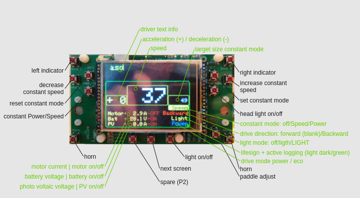

# SER4 Drivers Manual

## Preparation

## Control Elements

### Mainboard

(nothing to do by the driver)

### Emergency Controls

### Switch Board

### Steering Wheel

## Car Start

### Boot Screen

The bootscreen with blue font on yellow background shows the initialization of all devices controlled by the car control system.

The first part shows the device init, the second part shows the control task creation.

The last display is a 4 seconds countdown to allow an additional view to the values.

### Adjust Paddles

After each start the paddles must be adjusted. Until that the acceleration is locked. It is shown by the number `-99` in the `acceleration/deceleration` display and the drivers information Acceleration still locked.

Procedure:

- Press Button `ADJ`
- Move both paddles at same time slow from min to max to min.
  You have about 5s time for that.
- If successful the `acceleration/deceleration` display show `+ 0`
  Otherwise repeat the complete procedure

If the `acceleration/deceleration` display during the tour doesn't display `+ 0` the adjust procedure must be repeated.

## Car Operate

## Steering Wheel

### Buttons

#### Constant Mode

| Button                 | function                                         |
| ------------------------ | -------------------------------------------------- |
| SET (first time press) | set constant mode                                |
| SET (next time press)  | overtake current speed / power                   |
| RES                    | reset constant mode                              |
| PWR/SPD                | switch between constant power and constant speed |

### Paddles

### Display
